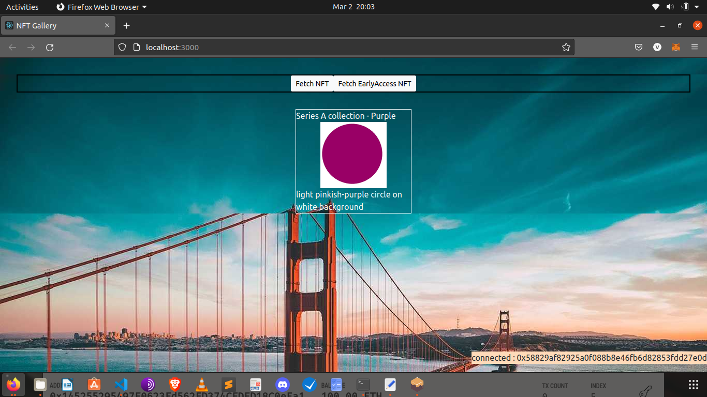

## Token-Gating : Provide Exclusive access to owners of a set of NFts

Explore a usecase of using ownership of NFT as a ticket or access pass.
NFTs can be used as tickets to events, owning an Nft can grant exclusive early access to another set of NFTs etc.

We have a promo object which determines the collection of NFTS you can get exclusive access by owning which NFTs.
- Series-A collection of NFTs have access to series-C collection
- Series-B collection of NFTs have access to series-D collection

## License

MIT
